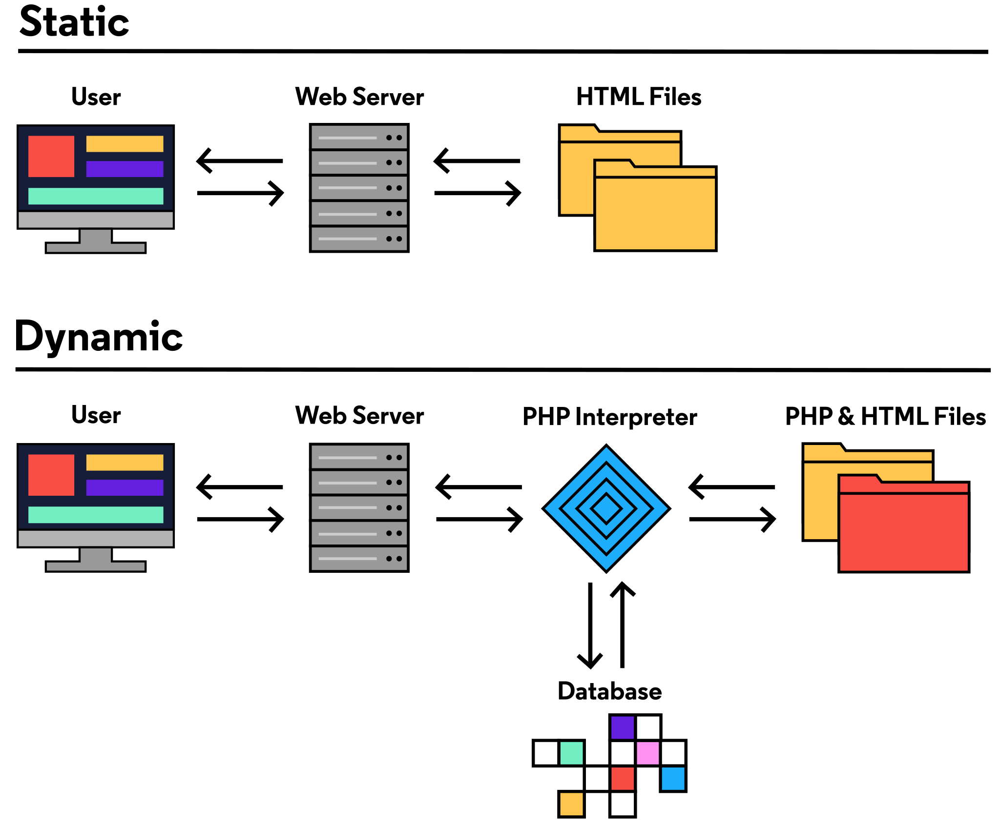

# PHP

## Debug
```
// web
$ php -S localhost:8080

//cli
$ php _.php

```
## Introduction
PHP is a general-purpose scripting language widely 
used as a server-side language for creating dynamic web pages.

* Created in 1994
* Functionality for interacting with web data, Vanilla PHP, or PHP without any other tools, can be used on its own to create web application back-ends. 
* Provides the underlying code for content management systems (CMS) (*CMS allows users to create and update their own websites without having to write a lot of complex code themselves.*)
    * Wordpress
    * Joomla
    * Drupal
* E-Commerce
    * Magento
    * Woo Commerce
* Frameworks
    * Laravel
    * CakePHP
    * Symfony        
    
* Dynamic web pages. A dynamic web page is one where each visitor to the website gets a customized page that can look different than how the site looks to another visitor. (*contrast to static web pages which provide the same content to each visitor.*)




### Example PHP

* With HTML
```
<p>This HTML will get delivered as is </p>
<?php echo "<p>But this code is interpreted by PHP and turned into HTML</p>"
    ;?>
```

* No HTML
```
<?php 
echo "Hello World";
?>
```

### String 

```
echo "Hello World"
```

* String List
```
echo "1. List";
echo "\n2. List;
```

* String Concatenation
```
echo "one"."two";
echo "one"." "."two";
```


### Variables

```
$variable_name = "value";
```
```
$dog_name = "Tadpole";
echo $dog_name; 

echo "I have a $color dog named $dog_name and her favorite food is $favorite_food.";

echo "I have a ${color}ish dog named $dog_name and her favorite food is ${favorite_food}s.";
```

* String concatenation with variables
```
 echo "\nI have always been obsessed with ${noun}s. I'm 
 ${adjective}ish. I'm always ${verb}ing.";

```
```
$full_name = "Aisle";
$full_name .= " Nevertell";
echo $full_name;
```

* copying variables
This new variable holds a copy of the value held by the original variable, but it’s an independent entity; changes made to either variable won’t affect the other:

```
$first_player_rank = "Beginner"; 
$second_player_rank = $first_player_rank; 
echo $second_player_rank; // Prints: Beginner

$first_player_rank = "Intermediate"; // Reassign the value of $first_player_rank
echo $second_player_rank; // Still Prints: Beginner
```

* replicate variables
create a new name which points to the same spot in memory.

```
$first_player_rank = "Beginner";
$second_player_rank =& $first_player_rank; 
echo $second_player_rank; // Prints: Beginner

$first_player_rank = "Intermediate"; // Reassign the value of $first_player_rank
echo $second_player_rank; // Prints: Intermediate
```
### Numbers 

```
echo 5 + 1; // Prints: 6
echo 6.6 + 1.2; // Prints: 7.8
echo 198263 - 263;  // Prints: 198000
echo -22.8 - 19.1;
```

### Functions 

```
function greetLearner()
{
  echo "Hello, Learner!\n";
  echo "I hope you're enjoying PHP!\n";
  echo "Love, Codecademy";
}
```

* Return Statement
Once the first return statement is executed, the function is exited.
```
function countdown() 
{
  echo "4, 3, 2, 1, ";
  return "blastoff!";
}

countdown() // prints "4, 3, 2, 1. "
```

```
function countdown() 
{
  echo "4, 3, 2, 1, ";
  return "blastoff!";
}

$return_value = countdown(); // Prints: 4, 3, 2, 1, 
echo $return_value; // Prints: blastoff!
```

* Return Statement before echo
As soon as the return statement is reached, the function will end
```
function announceRunning2()
{
  return "This is the return value of the second function.";
  echo "P.S., I love you";
}

$second_result = announceRunning2();
echo $second_result; // This is the return value of the second function.
```

* Return NUll 
functions without return statements? Any function without a return returns a special value NULL. NULL is a special data type that stands for the absence of a value.

```
function returnNothing() 
{
  echo "I'm running! I'm running!\n";
}

$result = returnNothing(); // Prints: I'm running! I'm running!

echo $result; // Nothing is printed

```

NULL can sometimes act like 0 

```
echo NULL * 3; // Prints: 0

echo NULL . "!"; // Prints: !
```

### functions and parameter 

```
function sayCustomHello($name)
{
echo "Hello, $name!";
};

sayCustomHello("Aisle Nevertell"); // Prints: Hello, Aisle Nevertell!

sayCustomHello("Codecademy learner"); // Prints: Hello, Codecademy Learner!
```

```
function returnFive()
{
  return 5;
}

function addTwoToNum($num)
{
  return $num + 2;
}

echo addTwoToNum(returnFive()); // Prints: 7
```

### function and multi parameters 

```
function divide($num_one, $num_two)
{
  return $num_one / $num_two;
};

echo divide(12, 3); // Prints: 4

echo divide(3, 12); // Prints: 0.25
```

### default oarameter 

```
function greetFriend($name = "old chum")
{
  echo "Hello, $name!";
};

greetFriend("Marvin"); // Prints: Hello, Marvin!

greetFriend(); // Prints: Hello, old chum!
```

### pass parameter

```
function addX ($param)
{
  $param = $param . "X";
  echo $param;
};
$word = "Hello";
addX($word); // Prints: HelloX
echo $word; // Prints: Hello
``` 

* make permanent changes
```
function addXPermanently (&$param)
{
  $param = $param . "X";
  echo $param;
};
$word = "Hello";
addXPermanently($word); // Prints: HelloX
echo $word; // Prints: HelloX
```

```
<?php

$string_one = "you have teeth";
$string_two = "toads are nice";
$string_three = "brown is my favorite color";

// Write your code below:

function convertToQuestion(&$str){
  $str = "Do you think ".$str."?\n";
}

convertToQuestion($string_one);
convertToQuestion($string_two);
convertToQuestion($string_three);
// function convertToQuestion(&$str)
// {
//   $str = "Do you think " . $str . "?\n";
// }

echo $string_one;
echo $string_two;
echo $string_three;
```
### Variable Scope 

```
$feed_quantity = 300;
function calculateDaysLeft($number, $rate)
{
  global $feed_quantity;
  $result = $feed_quantity / ($number * $rate);
  return $result;
}
echo calculateDaysLeft(2, 120);
```

## Built-in PHP functions

* gettype()
returns a string value representing the data type of the argument
```
$name = "Aisle Nevertell";
$age = 1000000;

echo gettype($name); // Prints: string

echo gettype($age); // Prints: integer
```

* var_dump()
prints details about the argument it receives
```
var_dump($name); // Prints: string(15) "Aisle Nevertell"

var_dump($age); // Prints: int(1000000)
```

* string 
   * strrev()
   ```
   echo strrev("Hello, World!"); // Prints: !dlroW ,olleH
   ```
   
   * strtolower()
   ```
   echo strtolower("HeLLo"); // Prints: hello
   ```

   * str_repeat()
   ```
   echo str_repeat("hi", 10);
   ```

   * substr_count()
   ```
   echo substr_count($story, "like"); // Prints: 8
   ```
   
    * strlen()

* numbers
   * abs()
   ```
   echo abs(-10.99);
   ```
   
   * round()
   ```
   echo round(1.2);;
   ```

   * getrandmax() , rand()
      * Invoking rand() with no arguments will return a number between 0 and the largest number our current environment will allow.
      * find out what this number is by invoking a different built-in function, getrandmax()
   ```
   $max = getrandmax(); 

   echo $max;

   echo rand(); // Prints a number between 0 and $max
   
   
   # rand() function, however is somewhat flexible.
   
   echo rand(1, 2); // Prints either 1 or 2

   echo rand(5, 10); // Prints a number between 5 and 10 (inclusive!)

   echo rand(1, 100); // Prints a number between 1 and 100 (inclusive!)
   
   ```

* Documentation
abs() has the type mixed because there are multiple data types the function will accept (an integer or a float).
The parameter for abs() is named $number. After the parentheses is a colon (:) followed by number; this is the data type the function will return.

```
abs ( mixed $number ) : number
```

```
substr_count ( string $haystack , string $needle [, int $offset = 0 [, int $length ]] ) : int

```
```
str_pad ( string $input , int $pad_length [, string $pad_string = " " [, int $pad_type = STR_PAD_RIGHT ]] ) : string


$a = 29;
$b = "You did it!";
$c = STR_PAD_BOTH;
$d = "*~*";

echo str_pad($b, $a, $d, $c);
```

## Array 

```
$my_array = array(0, 1, 2);

$mixed_array = array(1, "chicken", 78.2, "bubbles are crazy!");
```

* get no. of element in array 
```
echo count($my_array); // Prints: 3
echo count($string_array); // Prints: 2
echo count($mixed_array); // Prints: 4
```
### Arrays with Short Syntax

```
$number_array = [0, 1, 2];
```

* print array
```
print_r($number_array);
```

* print array element only in string 
```
echo implode(", ", $number_array);
```

* indexing array element
```
$my_array = ["tic", "tac", "toe"];

echo $my_array[1]; // Prints: tac
```

* adding element in array
```
$string_array = ["first element", "second element"];

$string_array[] = "third element";

echo implode(", ", $string_array); 
// Prints: first element, second element, third element 
```

* reassign element in array
```
$string_array = ["first element", "second element", "third element"];

$string_array[0] = "NEW! different first element";

echo $string_array[0]; // Prints: NEW! different first element"
```

* array methods : array_pop()
takes an array as its argument. It removes the last element of an array and returns the removed element.

```
$my_array = ["tic", "tac", "toe"];
array_pop($my_array); 
// $my_array is now ["tic", "tac"]

$popped = array_pop($my_array); 
// $popped is "tac"
// $my_array is now ["tic"]

```

* array methods : array_push()
takes an array as its first argument. The arguments that follow are elements to be added to the end of the array. array_push() adds each of the elements to the array and returns the new number of elements in the array.

```
$new_array = ["eeny"];
$num_added = array_push($new_array, "meeny", "miny", "moe"); 
echo $num_added; // Prints: 4
echo implode(", ", $new_array); // Prints: eeny, meeny, miny, moe 
```

* array methods : array_shift()
removes the first element of an array and returns that value. Each of the elements in the array will be shifted down an index.
```
$adjectives = ["bad", "good", "great", "fantastic"];
$removed = array_shift($adjectives); 
echo $removed; //Prints: bad
echo implode(", ", $adjectives); // Prints: good, great, fantastic 
```
* array methods : array_unshift
takes an array as its first argument. The arguments that follow are elements to be added to the beginning of the array. It returns the new number of elements in the array.
```
$foods = ["pizza", "crackers", "apples", "carrots"];
$arr_len = array_unshift($foods, "pasta", "meatballs", "lettuce"); 
echo $arr_len; //Prints: 7
echo implode(", ", $foods); 
// Prints: pasta, meatballs, lettuce, pizza, crackers, apples, carrots
```

### Nested Array 

* indexing 
```
$nested_arr = [[2, 4], [3, 9], [4, 16]];
$first_el = $nested_arr[0][0];
echo $first_el; // Prints: 2
```

### Associative Array 
* Associative arrays are collections of key=>value pairs
* key in Associative array can be string or interger
* values can be any type
* => operator to associate key with its value 
```
// short array syntax
$my_array = ["panda" => "very cute", "lizard" => "cute", "cockroach" => "not very cute"];


// array 
$about_me = array(
    "fullname" => "Aisle Nevertell",
    "social" => 123456789
);
```

* indexing elements in Assc Array
```
$my_array = ["panda"=>"very cute", "lizard"=>"cute", "cockroach"=>"not very cute"];
echo $my_array["panda"]; // Prints: very cute
```

* add elements in Assc Array 
```
$my_array["capybara"] = "cutest";
echo $my_array["capybara"]; // Prints: cutest
```


* expr in Assc Array 
```
$favorites = ["favorite_food"=>"pizza", "favorite_place"=>"my dreams", "FAVORITE_CASE"=>"CAPS","favorite_person"=>"myself"];

echo  $favorites["favorite" . "_" . "food"]; 
// Prints: pizza

$key =  "favorite_place";
echo  $favorites[$key];  
// Prints: my dreams

echo $favorites[strtoupper("favorite_case")];
// Prints: CAPS
```

* adding new element in Assc Array 
```
$new_arr = ["first" => "I am first!", "second" => "I am second!"]; 

$new_arr["third"] = "I am third!";

echo $new_arr["third"]; // Prints: I am third!

$new_arr["third"] = "I am the *NEW* third!";

echo $new_arr["third"]; // Prints: I am the *NEW* third!
```

* removing element in Assc Array with unset()
```
$nums = ["one" => 1,"two"=> 2];

echo implode(", ", $nums); // Prints: 1, 2

unset($nums["one"]);

echo implode(", ", $nums); // Prints: 2
```

* adding new element without specifying key
The first element is associated with the key 0, the second with 1, and so on. But ordered arrays are still the same structure as associative arrays.

When we add an element to an array without specifying a key (e.g. using array_push()), PHP will associate it with the “next” integer key. If no integer keys have been used, it will associate it with the key 0, otherwise it will associate it one more than the largest integer used thus far. 


```
$num_array = [1000 => "one thousand", 100 => "one hundred", 600 => "six hundred"];
$num_array[] = "New Element in \$num_array";
echo $num_array[1001]; // Prints: New Element in $num_array

$animals_array = ["panda"=>"very cute", "lizard"=>"cute", "cockroach"=>"not very cute"];
array_push($animals_array, "New Element in \$animals_array");
echo $animals_array[0]; // Prints: New Element in $animals_array
```

### Joining Arrays 
* combine arrays. The union (+) operator takes two array operands and returns a new array with any unique keys from the second array appended to the first array

```
// since "lizard" is not a unique key, $animal_rankings["lizard"] will retain the value of $my_array["lizard"] (which is "cute").

$my_array = ["panda" => "very cute", "lizard" => "cute", "cockroach" => "not very cute"];
$more_rankings = ["capybara" => "cutest", "lizard" => "not cute", "dog" => "max cuteness"];
$animal_rankings = $my_array + $more_rankings;
```
### Assign by Value or Reference

```
$favorites = ["food"=>"pizza", "person"=>"myself", "dog"=>"Tadpole"];
$copy = $favorites;
$alias =& $favorites;
$favorites["food"] = "NEW!";

echo $favorites["food"]; // Prints: NEW!
echo $copy["food"]; // Prints: pizza
echo $alias["food"]; // Prints: NEW!
```


```
function reallyChangeColor (&$arr) 
{
  $arr["color"] = "red";    
}
$object = ["shape"=>"square", "size"=>"small", "color"=>"green"];
reallyChangeColor ($object);
echo $object["color"]; // Prints: red
```
```
$doge_meme = ["top_text" => "Such Python", "bottom_text" => "Very language. Wow.", "img" => "very-cute-dog.jpg", "description" => "An adorable doge looks confused."];

$bad_meme = ["top_text" => "i don't know", "bottom_text" => "i can't think of anything", "img" => "very-fat-cat.jpg", "description" => "A very fat cat looks happy."];

// Write your code below:

function createMeme($meme){
   $meme["top_text"] = "Much PHP";
   $meme["bottom_text"] = "Very programming. Wow.";
   return $meme;
}


$php_doge = createMeme($doge_meme);


print_r($php_doge);

function fixMeme(&$meme){
  $meme["top_text"] = "TOP";
  $meme["bottom_text"] = "BOTTOM";
  return $meme;
}

fixMeme($bad_meme);

```
## PHP in HTML

```
<html>
 <head>
  <title>My First PHP Site</title>
 </head>
 <body>
 <?php 
    echo "<h1>Oh hi!</h1>"; 
  ?> 
 </body>
</html>
```

* complex php 

```
<?php
    $lucky_number = 5 * 2 - 1 ;
    echo "<h1>Your lucky number is ${lucky_number}</h1>";
?>
```

```
<?php
    function makeHeaderGreeting($name){
        return "<h1>Hello, ${name}!</h1>";
    }

    echo makeHeaderGreeting("World");

?>
```
```
<?php 

$about_me = [
  "name" => "Aisle Nevertell",
  "birth_year" => 1902,
  "favorite_food" => "pizza"
];

function calculateAge ($person_arr){
  $current_year = date("Y");
  $age = $current_year - $person_arr["birth_year"];
  return $age;
}
?>

<h1>Welcome!</h1>
<h2>About me:</h2>

<?php

#Add your code here
  echo "<h3>{$about_me["name"]}</h3>";
  echo "<p> ok ".calculateAge($about_me)." happy ? </p>";

  echo "<div>{$about_me["favorite_food"]} </div>";
?>
```

* short hand 
```
<?="<p>PHP interprets this and turns it into HTML</p>";?>
```

### Request Superglobals
 * to ease processing of HTML requests
 * When the front end client makes a request to a backend PHP server, several superglobals related to the request are available to the PHP script
 * Superglobals are automatic global variables which are available in all scopes throughout a script.
 * The list of superglobals in PHP includes the following:
 ```
   $GLOBALS
   $_SERVER
   $_GET
   $_POST
   $_FILES
   $_COOKIE
   $_SESSION
   $_REQUEST
   $_ENV
 ```

> $_GET - this contains an associative array of variables passed to the current script using query parameters in the URL
> $_POST - this contains an associative array of variables passed to the current script using a form submitted using the “POST” method
> $_REQUEST - this contains the contents of $_GET, $_POST, and $_COOKIE

```
<html>
<body>
$_REQUEST:
<?php print_r($_REQUEST) ?>
<br>
$_GET:
<?php print_r($_GET) ?>
<br>
$_POST:
<?php print_r($_POST) ?>
<form method="get">
GET Form: <input type="text" name="get_name">
<input type="submit" value="Submit GET">
</form>
<form method="post">
POST Form: <input type="text" name="post_name">
<input type="submit" value="Submit POST">
</form>
<a href="index.php">Reset</a>
</body>
</html>
```

## GET FORM HANDLING
setting a form’s method attribute to "get" specifies that you would like the form to be submitted using the GET method. When using this method, the form entries are passed as parameters in a URL query string

```
www.codecademy.com/?first=ellen&last=richards
```
this is a request to www.codecademy.com with the URL parameters first (set to the value "ellen") 
and last (set to the value "richards")

```
// parameter names (first and last) come from the name attribute of each form input

<form method="get">
First name: <input type="text" name="first">
<br>
Last name: <input type="text" name="last">
<br>
<input type="submit" value="Submit Name">
</form>
```

When the form is submitted, the form data is available in the $_GET superglobal array. (The data is also accessible using $_REQUEST if you do not care about which method was used by the client.)

```
print_r($_GET)

Array ( [first] => ellen [last] => richards )
```

```
<form method="get">
Country: 
<input type="text" name="country">
<br>
Language: 
<input type="text" name="language">
<br>
<input type="submit" value="Submit">
</form>
<br>
<p>Your language is:<?=$_GET["language"];?></p>
<p>Your country is:<?=$_GET["country"];?></p>
<a href="index.php">Reset</a>
```
## POST form handling 

setting a form’s method attribute to "post" specifies that you would like the form to be submitted using the POST method. When using POST to submit forms, you will not see the URL change. The form data is sent using the headers of the HTTP request instead of URL parameters.


To use the data from the form in PHP, each input needs to have a unique name attribute.

When the form is submitted, the input data is available in the $_POST superglobal. Similar to GET, it is also available in $_REQUEST.

```
// if a user typed “Katharine” into the first input and “McCormick” into the last input of this form

<form method="post">
First name: <input type="text" name="first">
<br>
Last name: <input type="text" name="last">
<br>
<input type="submit" value="Submit Name">
</form>

// The URL would not change and print_r($_POST) would look like this:
   
   Array ( [first] => Katharine [last] => McCormick )

```

```
<form method="post">
Favorite Color:
<input type="text" name="color">
<br>
Favorite Food:
<input type="text" name="food">
<br>
<input type="submit" value="Submit">
</form>
<br>
<p>Best food is: <?= $_POST["food"]?></p>
<p>Best color is: <?= $_POST["color"]?></p>
<a href="index.php">Reset</a>
```

## Action attribute 

If you would like to have the user navigate to a new URL and handle the form input there, you can specify the URL in the form’s action attribute. Since the action attribute specifies a relative URL, you can also enter the name of a PHP file in the same directory as the current one.

```
index.php
receive_form.php

// To handle a form using receive_form.php from index.php, you would use the following:
<form method="get" action="receive_form.php">

```
```
//index.php
<html>
<body>
<form method="get" action="greet_user.php">
First Name:
<input type="text" name="first">
<br>
Last Name:
<input type="text" name="last">
<br>
<input type="submit" value="Submit">
</form>

<a href="index.php">Reset</a>
</body>
</html>

//greet_user.php
<html>
<body>
<p>Thanks!</p>
<p>Your name has been recorded as:</p>
<p><?=$_GET["first"]." ".$_GET["last"]?></p>
<a href="index.php">Reset</a>
</body>
</html>
```

## Booleans and Comparison Operators

```
$is_clicked = TRUE;
if ($is_clicked) {
  $link_color = "purple";
  echo $link_color;
}
```

```
$is_clicked = FALSE;
if ($is_clicked) {
  $link_color = "purple";
  echo $link_color;
} else {
  $link_color = "blue";
  echo $link_color;
}
```

```
<?php
namespace Codecademy;

$learner_one = ["is_correct"=>FALSE, "box"=>["shape"=>"none", "color"=>"none"]];
   
$learner_two = ["is_correct"=>TRUE, "box"=>["shape"=>"none", "color"=>"none"]];
  
function markAnswer($bool,&$box){
 if($bool){
   $box["shape"] = "checkmark";
   $box["color"] = "green";
 } else {
   $box["shape"] = "x";
   $box["color"] = "red";
 }
}

markAnswer(
  $learner_one["is_correct"],
  $learner_one["box"]
);

print_r($learner_one["box"]);

markAnswer(
  $learner_two["is_correct"],
  $learner_two["box"]
);

print_r($learner_two["box"]);

?>
```
* elseif

```
function whatRelation($num){
  if($num === 100){
    echo "identical twins";
  } elseif($num >= 35 && $num <= 99){
    echo "parent and child or full siblings";
  } elseif($num >= 14 && $num <= 34){
    echo "grandparent and grandchild, aunt/uncle and niece/nephew, or half siblings";
  } elseif($num >= 6 && $num <= 13){
    echo "first cousins";
  } elseif($num >= 3 && $num <= 5){
    echo "second cousins";
  } elseif($num >= 1 && $num <= 2){
    echo "third cousins";
  } elseif($num === 0){
    echo "not genetically related";
  }
}
```

### switch

```
switch ($letter_grade){
  case "A":
    echo "Terrific";
    break;
  case "B":
    echo "Good";
    break;
  case "C":
    echo "Fair";
    break;
  case "D":
    echo "Needs Improvement";
    break;
  case "F":
    echo "See me!";
    break;
  default:
    echo "Invalid grade"; 
}
```

### switch fall through

//  if $day_of_week has the value "Monday" or "Tuesday", the string "Just getting started!" will be printed

```
switch ($day_of_week) {
  case "Monday":
  case "Tuesday":
    echo "Just getting started!";
    break;
  case "Wednesday":
    echo "Humpday!";
    break;
  case "Thursday":
  case "Friday":
    echo "Almost the weekend!";
    break;
  case "Saturday":
  case "Sunday":
    echo "Enjoy!";
    break;
}
```

### ternary operator 

```
$isClicked = FALSE;
$link_color = $isClicked ? "purple" : "blue";
```
```
function ternaryCheckout($items){
  return $items <=12 ? "express lane" : "regular lane";
}

function ternaryVote($age){
  return $age >= 18 ? "yes" : "no";
}
```

## truthy or falsy

* falsy

```


Empty strings
null
an undefined or undeclared variable
an empty array
the number 0
the string "0"
```

## user import 

```
echo "Hi, I'm Aisle Nevertell. What's your name?\n";
$name = readline(">> ");
echo "\nNice to meet you, $name";
```


```
echo "\nWhat's your favorite color?\n";
$color = readline(">> ");
if ($color === "green"){
  echo "\nCool, that's my favorite too!";
} else {
  echo "\nOh, $color is nice, I guess…";
}
```

```
echo "Hello, there. What's your first name?\n";
$name = readline(">> Type your name ?");

if(strlen($name) > 8){
  echo "Hi, ${name}. That's a long name.";
} elseif(strlen($name) >= 4 && strlen($name) <= 8){
  echo "Hi, ${name}.";
} elseif(strlen($name) <= 3){
  echo "Hi, ${name}. That's a short name.";
}
```

## Conditional Statements and Compound Conditions

```
  $is_elevator_here = true;
  $elevator_direction = "down";
  $my_direction = "up";
  $is_button_pushed = false;

  if ($is_elevator_here){
      if ($elevator_direction === $my_direction){
        echo "I'm in the elevator.";
      } else {
          if ($is_button_pushed){
            echo "I'm waiting...!";
          } else {
              echo "I'm pushing the button.";
          }
     }
  } else {
      if ($is_button_pushed){
          echo "I'm waiting...";
      } else {
          echo "I'm pushing the button.";
      }
   }
```

> The && operator has a higher operator precedence than the || operator.

```
TRUE || TRUE && FALSE // Evaluates to: TRUE

(TRUE || TRUE) && FALSE // Evaluates to: FALSE
```

> The not operator has very high operator precedence; be sure to use parentheses so that code evaluation happens as intended

```
!TRUE;    // Evaluates to: FALSE
!FALSE;   // Evaluates to: TRUE

!10 < 11; // Evaluates to: TRUE
!(10 < 11);  // Evaluates to: FALSE
!TRUE || TRUE; // Evaluates to: TRUE
!(TRUE || TRUE); // Evaluates to: FALSE
```

## XOR Operator

The logical operator xor stands for exclusive or. It takes two different boolean values or expressions as its operands and returns a single boolean value.

xor evaluates to TRUE only if either its left operand or its right operand evaluate to TRUE, but not both.

```
TRUE xor TRUE;   // Evaluates to: FALSE

FALSE xor TRUE;  // Evaluates to: TRUE

TRUE xor FALSE;  // Evaluates to: TRUE

FALSE xor FALSE; // Evaluates to: FALSE
```
```
$banana_cream = ["whole milk", "sugar", "cornstarch", "salt", "egg yolks", "butter", "vanilla extract", "bananas", "heavy cream", "powdered sugar"];
$experimental_pie = ["whole milk", "sugar", "bananas", "chicken", "salmon", "garlic"];

// Write your code below:
function eatPie($arr){
  if(in_array("chicken",$arr) xor in_array("bananas",$arr)){
    return "Delicious pie!" ;
  } else {
    return "Disgusting!";
  }
}

echo eatPie($banana_cream);
echo "\n\n";
echo eatPie($experimental_pie);
```

> The or and and logical operators have a lower precedence than || and &&.

```
TRUE || TRUE && FALSE // Evaluates to: TRUE
TRUE || TRUE and FALSE // Evaluates to: FALSE

(TRUE || TRUE) && FALSE // Evaluates to: FALSE
TRUE || (TRUE and FALSE) // Evaluates to: TRUE
```

## Multi-file Programs

```
// one.php
echo "How are";

// two.php
echo " you?";


// index.php
echo "Hello! ";
include "one.php";
include "two.php";
// Prints: Hello! How are you?


```
## while 
loop continues to iterate as long as its conditional is true.

```
$count = 1;
while ($count < 11)
{
  echo "The count is: " . $count . "\n";
  $count += 1;
}
```
## do while 
code block will execute once without the conditional being checked. After the first iteration, it behaves the same as a while loop.
only use this type of loop when you always need the code block to execute at least one time.

```
// to ask a user to guess a secret number
// This code asks the user to "Guess the number" and continues asking them until they successfully guess 42.

$count = 1;
do {
  echo "The count is: " . $count . "\n";
  $count += 1;
} while ($count < 11);
```
```
  $plant_height = 22;

  do {
    echo "The plant is ${plant_height} tall.\n";
    $plant_height += 1;

  }while($plant_height <= 30);
  if($plant_height >= 30){
      echo "And can produce fruit.";
    }
```

## for 

used to execute a code block a specific number of times.

```
for (#expression 1; #expression 2; #expression 3)
{
  # code block
}
```

The for loop syntax includes 3 expressions:

*   The first is evaluated only one time before the first iteration.
*   The second is evaluated before each iteration. If it is TRUE, the code block is executed. Otherwise, the loop terminates.
*   The third is evaluated after each iteration. Note that expressions 1 and 2 have semicolons after them.

```
for ($count = 1; $count < 11; $count++)
{
  echo "The count is: " . $count . "\n";
}
```
```
for($i = 10;$i >= 0; $i--){
  // echo $i."\n";
  if($i===2){
    echo "Ready!\n";
  }
  elseif($i===1){
    echo "Set!\n";
  } 
  elseif($i===0){
    echo "Go!";
  }
  else {
    echo $i."\n";
  }
}
```
## foreach
is used for iterating over an array. The code block is executed for every element in the array and the value of that element is available for use in the code block.

```
$counting_array = [1, 2, 3, 4, 5, 6, 7, 8, 9, 10];
foreach ($counting_array as $count) {
  echo "The count is: " . $count . "\n";
}
```
```
$details_array = ["color" => "blue", "shape" => "square"];
foreach ($details_array as $detail) {
  echo "The detail is: " . $detail . "\n";
}

/*
The detail is: blue
The detail is: square
*/

$details_array = ["color" => "blue", "shape" => "square"];
foreach ($details_array as $attribute => $detail) {
  echo "The " . $attribute . " is: " . $detail . "\n";
}

/*
The color is: blue
The shape is: square
*/
```

```
$scores = [
  "Alice" => 99,
  "Bob" => 95,
  "Charlie" => 98,
  "Destiny" => 91,
  "Edward" => 88
];

foreach($scores as $key => $value){
  echo "${key} received a score of ${value}.\n";
}
```
## break and continue 
break keyword can be used to terminate any of the loop types early.
```
$count = 1;
while ($count < 11)
{
  echo "The count is: " . $count . "\n";
  if ($count === 5) {
    break;
  }
  $count += 1;
}
```

continue keyword is similar to break except it only ends the current iteration early, not the entire loop.
```
$count = 1;
while ($count < 11)
{
  if ($count === 5) {
    $count += 1;
    continue;
  }
  echo "The count is: " . $count . "\n";
  $count += 1;
}
```